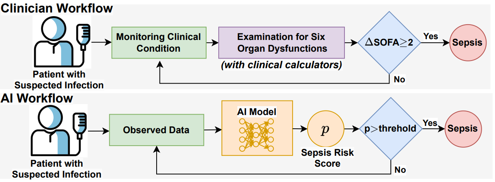
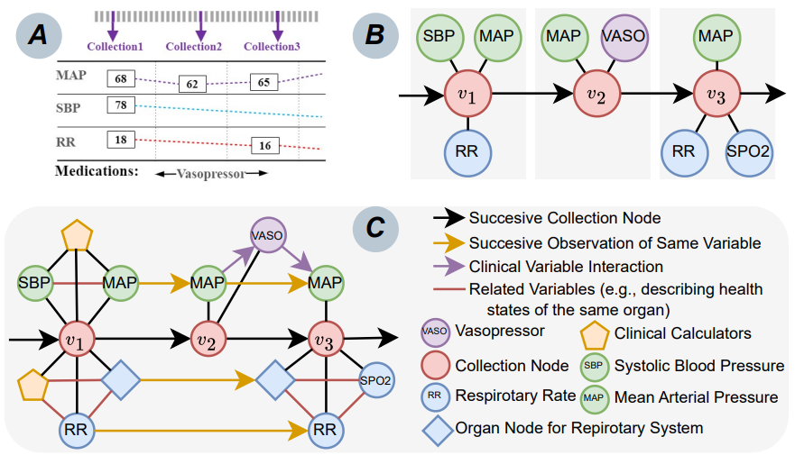
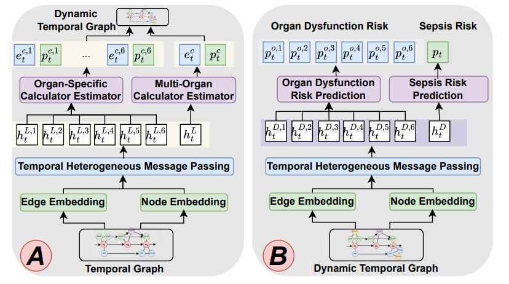
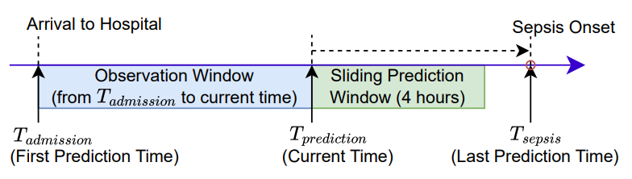
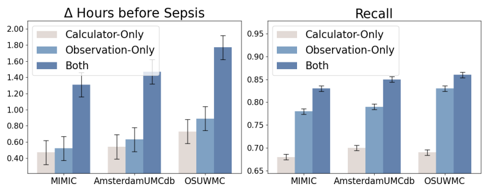
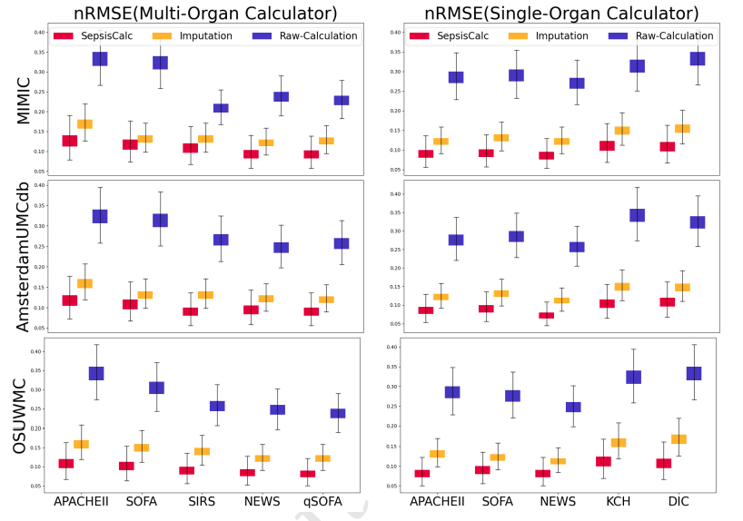
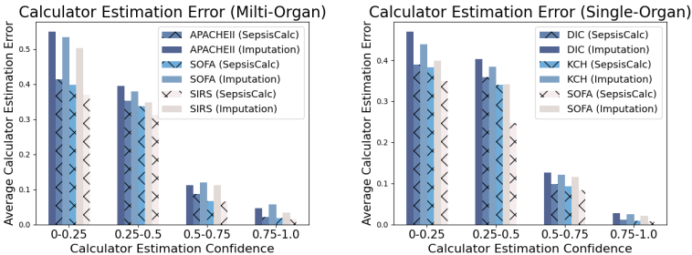
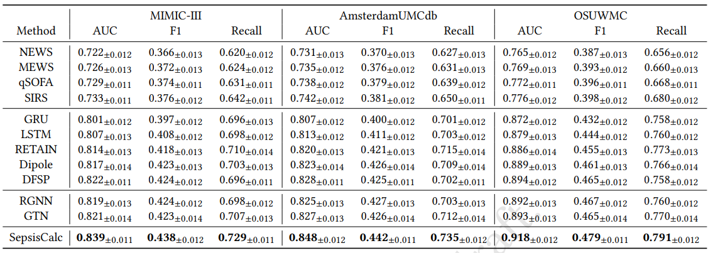
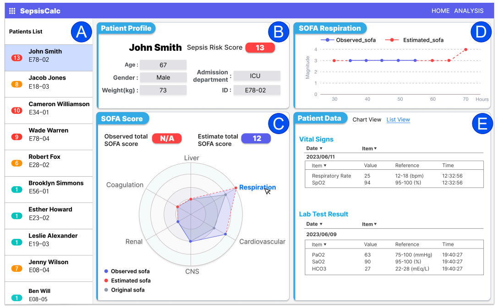
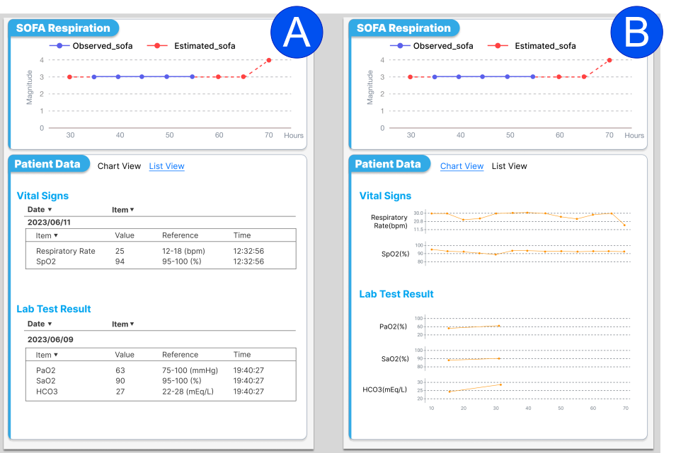

# SepsisCalc
SepsisCalc: Integrating Clinical Calculators into Early Sepsis Prediction via Dynamic Temporal Graph Construction


This repository contains the official PyTorch implementation of the following paper:

> **SepsisCalc: Integrating Clinical Calculators into Early Sepsis Prediction via Dynamic Temporal Graph Construction**<br> 
> [paper]()
>
> **Abstract:** *Sepsis is an organ dysfunction caused by a deregulated immune response to an infection. Early sepsis prediction and identification allow for timely intervention, leading to improved clinical outcomes. Clinical calculators (e.g., the six-organ dysfunction assessment of SOFA) play a vital role in sepsis identification within clinicians' workflow, providing evidence-based risk assessments essential for sepsis diagnosis. However, artificial intelligence (AI) sepsis prediction models typically generate a single sepsis risk score without incorporating clinical calculators for assessing organ dysfunctions, making the models less convincing and transparent to clinicians. To bridge the gap, we propose to mimic clinicians’ workflow with a novel framework SepsisCalc to integrate clinical calculators into the predictive model, yielding a clinically transparent and precise model for utilization in clinical settings. Practically, clinical calculators usually combine information from multiple component variables in Electronic Health Records (EHR), and might not be applicable when the variables are (partially) missing. We mitigate this issue by representing EHRs as temporal graphs and integrating a learning module to dynamically add the accurately estimated calculator to the graphs. Experimental results on real-world datasets show that the proposed model outperforms state-of-the-art methods on sepsis prediction tasks. Moreover, we developed a system to identify organ dysfunctions and potential sepsis risks, providing a human-AI interaction tool for deployment, which can help clinicians understand the prediction outputs and prepare timely interventions for the corresponding dysfunctions, paving the way for actionable clinical decision-making support for early intervention.*

# Framework



Workflows of clinicians and AI for sepsis identification. Clinicians examine sepsis by assessing organ dysfunctions with multiple clinical calculators as evidence, while AI workflow only gives an overall sepsis risk score.




Different EHR representation methods. (A) An example of sequential representation. (B) Example of graph
representation with temporal information of clinical observations. (C) The proposed dynamic temporal graph representation with clinical event interaction and clinical calculators.
Note that only partial calculator and organ nodes and edges are plotted for graph illustration in subfigure C.




Framework of SepsisCalc. (A) Dynamic temporal graph construction. (B) Sepsis prediction framework.


# Files Directory
    SepsisCalc
    |
    |--code
    |    |
    |    |--imputation                           * SepsisCalc generate calculators 
    |    |
    |    |--prediction                           * SepsisCalc predicts sepsis risks 
    |
    |--file                                 * The preprocessing codes will write some files here.
    |
    |--data                                 * Put the downloaded datasets here.
    |    |
    |    |--OSUWMC                           
    |    |    |
    |    |    |--train_groundtruth
    |    |    |
    |    |    |--sepsis_labels
    |    |
    |    |--MIMIC
    |    |    |
    |    |    |--train_groundtruth
    |    |    |
    |    |    |--sepsis_labels
    |    |    
    |    |--AmsterdamUMCdb
    |    |    |
    |    |    |--train_groundtruth
    |    |    |
    |    |    |--sepsis_labels
    | 
    | 
    |--result                             * The results of calculator estimation and sepsis prediction will be saved here.
    |    |--OSUWMC                           
    |    |
    |    |--MIMIC
    |    |    
    |    |--AmsterdamUMCdb

# Environment
Ubuntu16.04, python3.8


# Data preprocessing


## MIMIC-III data preprocessing
1. Download [MIMIC-III](https://mimic.physionet.org) dataset and put the data in TAME/data/MIMIC/initial\_mimiciii/.

2. Generate pivoted files (pivoted\_lab.csv, pivoted\_vital.csv, pivoted\_sofa.csv) according to [MIT-LCP/mimic-code](https://github.com/MIT-LCP/mimic-code/blob/master/concepts/pivot/), and put the data in TAME/data/MIMIC/initial\_mimiciii/.

3. Preprocess MIMIC-III data.
```
cd code/preprocessing
python preprocess_mimic_data.py --dataset MIMIC
python generate_sepsis_variables.py --dataset MIMIC
python generate_value_distribution.py --dataset MIMIC
```


# Model Training and Evaluation

```
cd code/prediction
python main.py --dataset MIMIC
```

# Experiment
## Setting


## Q1: Why must we incorporate the clinical calculator scores?

Setting of sepsis onset prediction.


Sepsis risk prediction performance in both full and missing observation settings



Average alert time before sepsis and recall

##  Q2: Are the estimated clinical calculator scores effective?


nRMSE of clinical calculator estimation (mask observation setting). All the component variables of the calculators are observed and the ground truths of calculators
are available. We randomly mask 70% component variables.
Raw-calculation means the original clinical methods that
use the latest observed variables to compute the calculators.



Calculator estimation error over confidence levels.

## Q3: How do estimated calculator scores improve early sepsis prediction system?



Sepsis prediction results.
 
# Deployment



User Interface of SepsisCalc System. (A) Patient list with sepsis risk score. (B) Demographic information. (C) Overall
SOFA scores. (D) Organ-specific SOFA score. (E) Vital signs and lab test results related to the specific organ.




(A) List view of clinical variables for organ status.
(B) Chart view of clinical variables for organ status